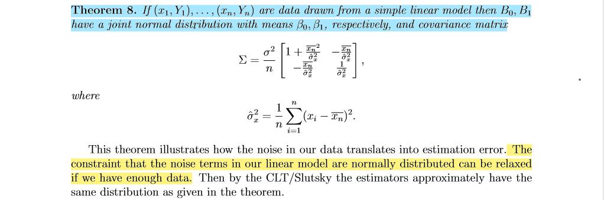
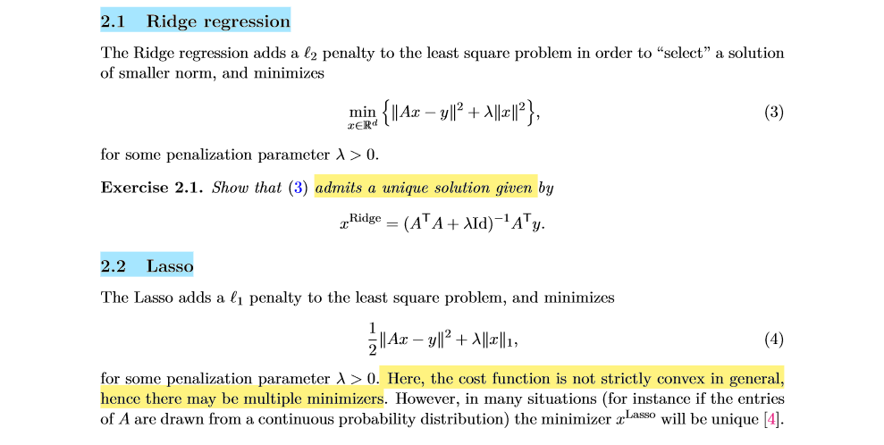

# Content
1. [Linear Regression](#LinearRegression)
2. [LASSO and Ridge](#LASSOandRidge)
3. [Logistic Regression](#LogisticRegression)
4. [Naive Bayes](#NaiveBayes)
# Main References
- [Introduction to Data Science (NYU CDS 1001)](https://github.com/briandalessandro/DataScienceCourse/tree/master/ipython)
- Notes of Probability and Statistics for Data Science (NYU CDS 1002)
- [Optimization and Computational Linear Algebra for Data Science (NYU CDS 1002)](https://leomiolane.github.io/linalg-for-ds.html)
- [Bruce Yang: The Breadth of Machine Learning: Part I](https://bruceyanghy.github.io/posts/machine_learning_breadth/index_breadth.html)

# Linear Regression <a name="LinearRegression"></a>
## Basic Concepts 


- Xs are the covariates (or features, or inputs, or independent variables) 
- Y is the response (or outcomes, or outputs, or dependent variable.
- Noise Term (or errors): i.i.d. Gaussian random variables
- Residuals: The errors in our predictions

## Assumptions
1. Linearity: 
    - There is a linear relationship between the covariates and the response. 
    - Linear relationship can be assessed with scatter plots.
2. (Normality): 
    - Variables follow a Gaussian Distribution.
    - Normality can be assessed with histograms. Normality can also be statistically tested, for example with the Kolmogorov-Smirnov test.
    - When the variable is not normally distributed a non-linear transformation like Log-transformation may fix this issue.
3. The Noise Term
    - The error term is assumed to be a random variable that has a mean of 0 and normally distributed (i.i.d. Gaussian random variables).
    - (Residuals are statistically independent, have uniform variance, are normally distributed)
    - Why
    
    - When the errors are not normally distributed, it is OK if we have enough data.
4. Homoscedasticity
    - The error term has onstant variance σ2 at every value of X. 
    - Why
    
    - There are tests and plots to determine homescedasticity. Residual plots, Levene's test, Barlett's test, and Goldfeld-Quandt Test.
    - In the heteroscedastic, we can use Weighted Least Squares (WLS) to transform the problem into the homoscedastic case.
5. Non-Collinearity (Xs is full column rank in Linear Algerba): 
    - Multicolinearity occurs when the independent variables are correlated with each other.
    - Why : Multicolinearity means Xs has no full column rank, and by rank-nullity theorem, dimension of ker(Xs) bigger than 0. Hence, it will have more than one soulution.
    - This can be check by heat map of correlation.
 
## Solutions: Mean Squared Error (MSE)
1. Simple Linear Model:

2. General Linear Model (Squared Error is a Convex Funcion):

3. Unbiased Estimation (MSE): 

4. Hypothesis Tesing & Confidence Interval: for β0, β1, for β0 + β1x (fitted Y)
5. Predicted Interval: Note that prediction intervals are slightly different from confidence intervals, since Y is random (along with the endpoints of the interval). Our prediction interval for Y will incorporate our uncertainty in estimating β0 + β1x, and the noise Z present in Y.


## Useful Points of Linear Model
1. In simple linear model, the fitted line pass through the sample central point.
2. In simple linear model, if X and Y are standardized, correlation is equal to slope. 
3. Centerated Resduals. In linear model, sum of residual equal to zero.
4. Reduced Variance: 
    - R-squared: proportion of variance explained by the fit
    - Adjusted R-squared: compared with R-squared, it isn’t guaranteed to grow as we add features (due to the n−k denominator that penalizes larger models), and thus can be more useful. Other methods for weighing goodness-of-fit against model complexity include the AIC, BIC, and Mallows’s Cp.
5. Leverage: Slope has the highest sensitivity to points furthest from the mean 

## Advantages/Disadvantages
**Pros**:
- Simplicity and interpretability: linear regression is an extremely simple method. It is very easy to use, understand, and explain.
- The best fit line is the line with minimum error from all the points, it has high efficiency
- It needs little tuning

**Cons**:
- Linear regression only models relationships between dependent and independent variables that are linear. It assumes there is a straight-line relationship between them which is incorrect sometimes.
- Linear regression is very sensitive to the outliers in the data (See Leverage). 
- Linear regression is very sensitive to missing data. (biased parameter)
- Linear regression needs feature scaling. (for gradient descent)
- If the number of the parameters are greater than the samples, then the model starts to model noise rather than relationship
- Correlated features may affect performance.
- Extensive feature engineering required.

## Quesion Part
### Question 1.1: Missing feature
If you fit a linear model that has some features missing, will your least squares estimates of the reduced model be biased? 
- It will be Biased, unless the omitted features are uncorrelated with the included features. 

### Question 1.2: Extra feature
If you fit a linear model that has some extra features, will your least squares estimates of the enlarged model be biased?
- It will be Unbiased. Even though adding features does not introduce bias (and can decrease it), it can increase the variance of our estimates and produce larger confidence intervals and prediction intervals. 

### Question 2: More Data
What if you duplicate all the data and do regression on the new data set?
-  The mean and variance of the sample would not change therefore the beta estimation would be the same. The standard error will go down. However, since the sample size is doubled this will result in the lower p-value for the beta. This tells us that by simply doubling/duplicating the data, we could trick the regression model to have smaller confidence interval.


# LASSO and Ridge <a name="LASSOandRidge"></a>
## Basic Concepts


## Advantages/Disadvantages of LASSO
**Pros**:
- Useful for feature selection
- Much easier to interpret and produces simple models
- Lasso to perform better in a setting where a relatively small number of predictors have substantial coefficients, and the remaining predictors have coefficients that are very small or that equal zero

**Cons**:
- LASSO has no closed formula
- LASSO needs feature scaling. (for fair regularization to parameters)
- For n'<'p case (high dimensional case), LASSO can at most select n features. This has to do with the nature of convex optimization problem LASSO tries to minimize.
- For usual case where we have correlated features which is usually the case for real word datasets, LASSO will select only one feature from a group of correlated features. That selection also happens to be arbitrary in nature. Often one might not want this behavior. Like in gene expression the ideal gene selection method is: eliminate the trivial genes and automatically include whole groups into the model once one gene among them is selected (‘grouped selection’). LASSO doesn't help in grouped selection.

## Advantages/Disadvantages of Ridge
**Pros**:
- Useful for preventing overfitting. As lambda increases, the shrinkage of the ridge coefficient estimates leads to a substantial reduction in the variance of the predictions, at the expense of a slight increase in bias.
- Ridge regression works best in situations where the least squares estimates have high variance. Meaning that a small change in the training data can cause a large change in the least squares coefficient estimates
- Ridge regression has unique solution and has substantial computational advantages.

**Cons**:
- Ridge regression is not able to shrink coefficients to exactly zero. As a result, it cannot perform feature selection.
- LASSO needs feature scaling. (for fair regularization to parameters)

## Quesion Part
### Question 1: Feature Selection
Why LASSO has the property of _feature selection_ but Ridge does not?
- By Intuition


- By Lasso Solution: (Note there is not closed form formula for Lasso, unless A has orthnormal matrix)


### Question 2: Regularization
What is regularization?
- What: Regularization is used to prevent overfitting. It significantly reduces the variance of the model, without substantial increase in its bias. It will improve the generalization of a model and decrease the complexity of a model.
- How: It adds a penalty on the loss function to reduce the freedom of the model. Hence the model will be less likely to fit the noise of the training data. 

### Question 3: Parameter Tuning
How to choose Lambda?
- Lambda is the tuning parameter that decides how much we want to penalize the flexibility of our model. As lambda increases, the impact of the shrinkage penalty grows, and the ridge regression coefficient estimates will approach zero. Selecting a good value of lambda is critical, we can use cross validation to choose good lambda.


# Logistic Regression <a name = "LogisticRegression"></a>
## Basic Concept:
Logistic Regression is a classification method, usually do binary classification 0 or 1. A logistic model is one where the log-odds(logit) of the probability of an event is a linear combination of independent variables.

## Assumptions:
- The outcome is a binary variable like yes vs no, positive vs negative, 1 vs 0.
- There is a linear relationship between the logit of the target and independent variables.
- Others similiar to linear regression, such as multi-collinearity.

## Cost function: 
- Log-loss (Cross-Entropy)


- Understand Cross-Entropy from information theory:


- MLE: For large data, the theory of MLEs can be used to show that the parameter estimates are jointly normally distributed, and confidence intervals can be computed. 
- The difference between the cost function and the loss function: The loss function computes the error for a single training example; the cost function is the average of the loss function of the entire training set.

### Advantages/Disadvantages
**Pros**:
- Outputs have a nice probabilistic interpretation.
- Based on MLE, we can do hypothesis testing on the parameter estimates of the model.
- The algorithm can be regularized to avoid overfitting. Multi-collinearity is not really an issue and can be countered with L2 regularization to an extent.
- Logistic Regression has been proven over and over to be very robust in small data problems, because it has strong assumption. For example: Learning curve analysis shows that LR performs better than DT in small data scenarios)
- Logistic models can be updated easily with new data using stochastic gradient descent.
- Linear combination of parameters β and the input vector will be incredibly easy to compute.
- Wide spread industry comfort for logistic regression solutions.

**Cons**:
- Logistic regression tends to underperform when there are multiple or non-linear decision boundaries. They are not flexible enough to naturally capture more complex relationships. 
- Doesn’t handle large number of categorical features/variables well.

## Extension: Another Perspective to Regularization - Bayesian MAP


## Extension: Activation Functions (in Neural Network)
_Ref._ [7 types neural network activation functions](https://missinglink.ai/guides/neural-network-concepts/7-types-neural-network-activation-functions-right/#commonnonlinear)

### Sigmoid / Logistic
- Pros
    - Smooth gradient, preventing “jumps” in output values.
    - Output values bound between 0 and 1, normalizing the output of each neuron.
    - Clear predictions: for X above 2 or below -2, tends to bring the Y value (the prediction) to the edge of the curve, very close to 1 or 0. This enables clear predictions.
- Cons
    - Vanishing gradient: for very high or very low values of X, there is almost no change to the prediction, causing a vanishing gradient problem. This can result in the network refusing to learn further, or being too slow to reach an accurate prediction.
    - Outputs not zero centered.
    - Computationally expensive

### TanH / Hyperbolic Tangent
- Pros
    - Zero centered—making it easier to model inputs that have strongly negative, neutral, and strongly positive values.
    - Otherwise like the Sigmoid function.
- Cons
    - Like the Sigmoid function

### ReLU (Rectified Linear Unit)
- Pros
    - Computationally efficient—allows the network to converge very quickly
    - Non-linear: although it looks like a linear function, ReLU has a derivative function and allows for backpropagation
- Cons
    - The Dying ReLU problem: when inputs approach zero, or are negative, the gradient of the function becomes zero, the network cannot perform backpropagation and cannot learn.

### Extension: Softmax (Muti-class Activation Function)

- Pros
    - Able to handle multiple classes: only one class in other activation functions—normalizes the outputs for each class between 0 and 1, and divides by their sum, giving the probability of the input value being in a specific class.
    - Useful for output neurons—typically: Softmax is used only for the output layer, for neural networks that need to classify inputs into multiple categories. 
- Usage in torch:
    - [NLLLoss](https://pytorch.org/docs/stable/generated/torch.nn.NLLLoss.html): The negative log likelihood loss. It is useful to train a classification problem with C classes. The input given through a forward call is expected to contain log-probabilities of each class. Obtaining log-probabilities in a neural network is easily achieved by adding a _LogSoftmax_ layer in the last layer of your network.
    - [CrossEntropyLoss](https://pytorch.org/docs/stable/generated/torch.nn.CrossEntropyLoss.html): If you prefer not to add an extra layer (_LogSoftmax_), you may use _CrossEntropyLoss_ instead. _CrossEntropyLoss_ combines nn.LogSoftmax() and nn.NLLLoss() in one single class. 

# Niave Bayes <a name="NaiveBayes"></a>
## Basic Concepts & Assumptions
Naive Bayes is a **generative model**, and is used for classification problems, especially text classification.
Many language processing tasks can be viewed as tasks of classification. Text categorization,in which an entire text is assigned a class from a finite set, includes such tasks as sentiment analysis, spam detection, language identification, and authorship attribution. Sentiment analysis classifies a text as reflecting the positive or negative orientation (sentiment) that a writer expresses toward some object. 
1. Bayes' Rule: 

2. Assumptions: 
    - the bag of words assumption (position doesn’t matter) 
    - the conditional independence assumption (words are conditionally independent of each other given the class; the occurrence of a certain feature is independent of the occurrence of other features)
    

## Laplace Smoothing (Variance-Bias Trade-off)
If categorical variable has a category (in test data set), which was not observed in training data set, then model will assign a 0 (zero) probability and will be unable to make a prediction. This is often known as “Zero Frequency”. To keep a model from assigning zero probability to these unseen events, we’ll have to shave off a bit of probability mass from some more frequent events and give it to the events we’ve never seen. This modification is called smoothing or discounting. Those method will decrease variance at the cost of increasing bias.
The simplest way to do smoothing is to add one to all the counts, which is Laplace Smotthing. 


## Pseudo Code of Naive Bayes with Laplace Smoothing


### Advantages/Disadvantages 
**Pros**:
- It is easy and fast to predict class of test data set. Needs less training time. Good with moderate to large training data sets. It could be used for making predictions in real time.
- It also perform well in multi class prediction.
- Naive Bayes Classifier and Collaborative Filtering together could build a Recommendation System that uses machine learning and data mining techniques to filter unseen information and predict whether a user would like a given resource or not
- Good when dataset contains many features.
- When assumption of independence holds, a Naive Bayes classifier performs better compare to other models like logistic regression and you need less training data.

**Cons**:
- On the other side naive Bayes is also known as a bad estimator, so the probability outputs from predict_proba are not to be taken too seriously.
- Another limitation of Naive Bayes is the assumption of independent predictors. In real life, it is almost impossible that we get a set of predictors which are completely independent.

## Extention: [Conjugate Prior](https://en.wikipedia.org/wiki/Conjugate_prior)
- In Bayesian probability theory, if the posterior distributions p(θ | x) are in the same probability distribution family as the prior probability distribution p(θ), the prior and posterior are then called conjugate distributions, and the prior is called a conjugate prior for the likelihood function p(x | θ). 
 

- Examples 
    - Beta prior, Bernoulli samples
    - Normal prior, Normal samples
    - Gamma prior, Poisson samples

- Understanding Laplace Smoothing
 
The beta distribution is the conjugate prior of the Binomial distribution. It is a special form of the Dirichlet distribution, where X has only two discrete values. The Dirichlet prior has a specific application to Naïve Bayes because X is often defined as a multinomial. In many cases we only want to deal with a binary random variable, which makes the beta distribution appropriate.


<!-- ## Welcome to GitHub Pages

You can use the [editor on GitHub](https://github.com/hedygithub/DiHe.github.io/edit/gh-pages/index.md) to maintain and preview the content for your website in Markdown files.

Whenever you commit to this repository, GitHub Pages will run [Jekyll](https://jekyllrb.com/) to rebuild the pages in your site, from the content in your Markdown files.

### Markdown

Markdown is a lightweight and easy-to-use syntax for styling your writing. It includes conventions for

```markdown
Syntax highlighted code block

# Header 1
## Header 2
### Header 3

- Bulleted
- List

1. Numbered
2. List

**Bold** and _Italic_ and `Code` text

[Link](url) and 
```

For more details see [GitHub Flavored Markdown](https://guides.github.com/features/mastering-markdown/).

### Jekyll Themes

Your Pages site will use the layout and styles from the Jekyll theme you have selected in your [repository settings](https://github.com/hedygithub/DiHe.github.io/settings). The name of this theme is saved in the Jekyll `_config.yml` configuration file.

### Support or Contact

Having trouble with Pages? Check out our [documentation](https://docs.github.com/categories/github-pages-basics/) or [contact support](https://github.com/contact) and we’ll help you sort it out.
 -->
