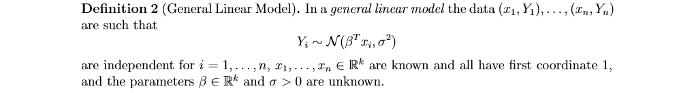
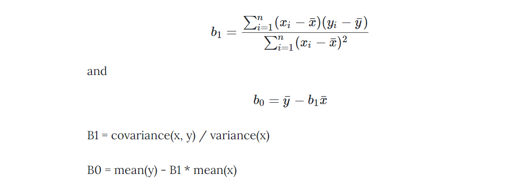

# Content 1
- [Data Science Overview](#overview)
- [Data](#data)
- [Exploratory Data Analysis & Feature Engineering](#EDA)

# Content 2
- [Linear Regression [Regression]](#LinearRegression)
- [LASSO and Ridge [Regression]](#LASSOandRidge)
- [Logistic Regression [Classification]](#LogisticRegression)
- [Naive Bayes [Classification]](#NaiveBayes)
- [Support Vector Machine [Classification]](#SVM)
- [Decision Tree [Classification]](#DecisionTree)
- [Ensemble Overview & Stacking [Ensemble]](#Stacking)
- [Bagging & Random Forest [Ensemble]](#Bagging)
- [Boosting, AdaBoost & Gradient Boosting](#Boosting)
- [K-Nearest Neighbors](#knn)
- [Clustering Overview & K-Means [Clustering]](#kmeans)

# Main References
- [Introduction to Data Science (NYU CDS 1001)](https://github.com/briandalessandro/DataScienceCourse/tree/master/ipython)
- Book: Data Science for Business
- Notes of Probability and Statistics for Data Science (NYU CDS 1002)
- [Optimization and Computational Linear Algebra for Data Science (NYU CDS 1002)](https://leomiolane.github.io/linalg-for-ds.html)
- [Bruce Yang: The Breadth of Machine Learning: Part I](https://bruceyanghy.github.io/posts/machine_learning_breadth/index_breadth.html)
- [K-Means Clustering in Python: A Practical Guide](https://realpython.com/k-means-clustering-python/)


# Data Science Overview <a name="overview"></a>
## Categories
### Basic Categories
- Supervised Learning
    - Regression
    - Classfication & Class Probability Estimation
- Unsupervised Learning
    - Clustering

### Categories by Parameters
- Parametric Modeling
    - Linear Regression
    - SVM
- Non-Parametric Modeling
    - Decision Tree
    - KNN
    - K-Means

### Categories for Classfication 
- Discrimative
    - Logistic Regression
- Generative
    - Naive Bayes

### Categories by Application
- Similarity matching attempts 
- Co-occurrence grouping
- Profiling (behavior description)
- Link prediction
- Data reduction
- Causal modeling

## Cross Industry Standard Process for Data Mining
- Business Understaning
- Data Understanding
- Data Preparation
- Modeling
- Evaluation
- Deployment

## Components
- Feature Representation
- Model
- Objective Function
- Algorithm for Optimizing

## Concerns
Concept Drift: P(X), P(Y) or P(Y|X) that changes over time
Methods to handle it:
- Monitor predictive performance
- Retrain as often as possible
- Test balance between data recency and data volume

# Data & Data Cleaning <a name="data"></a>
## Think about:
- Where to get data
- How to get data
- What does the data look like
- What's the limits

## Souces:
- Internal ETL Process
- Production Logging / Sampling
- Web Scraping / API
- Survey / Panel

## Selction Bias
### Implications:
- Affect generalizability
- Affect identifiablity of model parameters

### Unbias(random) Sample Test
1. Independent on X (don't want to be biased): 
    - P(Sampled) = P(Sampled | X = x) 
    - or P(X = x) = P(X = x | Sampled) 
2. Independent on Y (sometimes intentional bias on Y): 
    - P(Sampled) = P(Sampled | Y = y) 
    - or P(Y = y) = P(Y = y | Sampled) 

### Intentional Selection Bias
- Often select based on target variable
- It is rational and based on business and economic factors

### What to do
- Avoid it
- Adjust it
- Expect it


# Exploratory Data Analysis & Feature Engineering <a name="EDA"></a>
## Goals to do EDA
- Summarize main characteristics of the data [Univariate]
- Gain better understanding of the data set [Univariate]
- Uncover **relationships between variables** [Bivariate]
- Know the data set from a global view [Multivariate]
- Extract important variables

## Descriptive Statistics
- Know data types
    - Numeric
        - Continuous
        - Discrete
    - Categorical
        - Ordinal
        - Nominative
    - Date
- Summariz statistics using pd.describe()
- Distribution: Box Plots, Scatterplot

## Data Cleaning
1. Missing Values
Check with data collection source
- Delete: Random & Rare
- Fill Constants: Mean, Median, Dummy Variables
- Exploit Mulit-Collinearity: Estimate E[missing | X]

2. Data Formating 
- Correct data types
- Apply calculations to incoherent representations

3. Outliers
- Delete

4. Scale Difference
- Normalization
    - Simple Feature Scaling (X / X_max)
    - Min-Max
    - Z-score

5. Skewed Distribution (for Linear Regression)
- Standardize: Log()

6. Data Binning
- Group a set of numerical values into a set of "Bins"

7. Turning categorical variables into quantitative variables 
- One-hot encoding 

## Bivariate
1. Correlation for Numerical
- Covariance Matrix & Heatmap

**Pros**:
- Expresses negative dependencies
- Well understood and intuitive (easy to communicate)

**Cons**:
- Can not capture non-linear dependencies better
- Not apply to categorical data

2. Mutual Information


**Pros**:
- Can capture non-linear dependencies better
- Works naturally with categorical data

**Cons**：
- Can not express negativedependencies

3. Numerical variable group by Categorical variable
- Analysis of Variance (ANOVA):
    - ANOVA: finding correlation between different groups of categorical values
    - F-test: variation between sample group means divided by variation within sample group
- Two sample T-test

4. AUC for Numerical and Categorical

## Multivariate
### Singular Value Decomposition
The relative difference between singular values is a function of the level of independence of the columns.
Applications:
- The low rank approximation & Data Compression
    - Cost: the information retained ratio
- Dimensionality Reduction
- Recommender Systems
- Clustering in High Dimensions


## Extract Extra Features
- Datetime
    - Weekday, Weekend
    - Holiday
    - ...
- Numerical Variable to Categorical
    - Binning
    - Clustering


# Linear Regression <a name="LinearRegression"></a>
## Basic Concepts 


- Xs are the covariates (or features, or inputs, or independent variables) 
- Y is the response (or outcomes, or outputs, or dependent variable.
- Noise Term (or errors): i.i.d. Gaussian random variables
- Residuals: The errors in our predictions

## Assumptions
1. Linearity: 
    - There is a linear relationship between the covariates and the response. 
    - Linear relationship can be assessed with scatter plots.
2. (Normality): 
    - Variables follow a Gaussian Distribution.
    - Normality can be assessed with histograms. Normality can also be statistically tested, for example with the Kolmogorov-Smirnov test.
    - When the variable is not normally distributed a non-linear transformation like Log-transformation may fix this issue.
3. The Noise Term
    - The error term is assumed to be a random variable that has a mean of 0 and normally distributed (i.i.d. Gaussian random variables).
    - (Residuals are statistically independent, have uniform variance, are normally distributed)
    - Why
    
    - When the errors are not normally distributed, it is OK if we have enough data.
4. Homoscedasticity
    - The error term has onstant variance σ2 at every value of X. 
    - Why
    
    - There are tests and plots to determine homescedasticity. Residual plots, Levene's test, Barlett's test, and Goldfeld-Quandt Test.
    - In the heteroscedastic, we can use Weighted Least Squares (WLS) to transform the problem into the homoscedastic case.
5. Non-Collinearity (Xs is full column rank in Linear Algerba): 
    - Multicolinearity occurs when the independent variables are correlated with each other.
    - Why : Multicolinearity means Xs has no full column rank, and by rank-nullity theorem, dimension of ker(Xs) bigger than 0. Hence, it will have more than one soulution.
    - This can be check by heat map of correlation.
 
## Solutions: Mean Squared Error (MSE)
1. Simple Linear Model:

2. General Linear Model (Squared Error is a Convex Funcion):

3. Unbiased Estimation (MSE): 

4. Hypothesis Tesing & Confidence Interval: for β0, β1, for β0 + β1x (fitted Y)
5. Predicted Interval: Note that prediction intervals are slightly different from confidence intervals, since Y is random (along with the endpoints of the interval). Our prediction interval for Y will incorporate our uncertainty in estimating β0 + β1x, and the noise Z present in Y.


## Useful Points of Linear Model
1. In simple linear model, the fitted line pass through the sample central point.
2. In simple linear model, if X and Y are standardized, correlation is equal to slope. 
3. Centerated Resduals. In linear model, sum of residual equal to zero.
4. Reduced Variance: 
    - R-squared: proportion of variance explained by the fit
    - Adjusted R-squared: compared with R-squared, it isn’t guaranteed to grow as we add features (due to the n−k denominator that penalizes larger models), and thus can be more useful. Other methods for weighing goodness-of-fit against model complexity include the AIC, BIC, and Mallows’s Cp.
5. Leverage: Slope has the highest sensitivity to points furthest from the mean 

## Advantages/Disadvantages
**Pros**:
- Simplicity and interpretability: linear regression is an extremely simple method. It is very easy to use, understand, and explain.
- The best fit line is the line with minimum error from all the points, it has high efficiency
- It needs little tuning

**Cons**:
- Linear regression only models relationships between dependent and independent variables that are linear. It assumes there is a straight-line relationship between them which is incorrect sometimes.
- Linear regression is very sensitive to the outliers in the data (See Leverage). 
- Linear regression is very sensitive to missing data. (biased parameter)
- Linear regression needs feature scaling. (for gradient descent)
- If the number of the parameters are greater than the samples, then the model starts to model noise rather than relationship
- Correlated features may affect performance.
- Extensive feature engineering required.

## Quesion Part
### Question 1.1: Missing feature
If you fit a linear model that has some features missing, will your least squares estimates of the reduced model be biased? 
- It will be Biased, unless the omitted features are uncorrelated with the included features. 

### Question 1.2: Extra feature
If you fit a linear model that has some extra features, will your least squares estimates of the enlarged model be biased?
- It will be Unbiased. Even though adding features does not introduce bias (and can decrease it), it can increase the variance of our estimates and produce larger confidence intervals and prediction intervals. 

### Question 2: More Data
What if you duplicate all the data and do regression on the new data set?
-  The mean and variance of the sample would not change therefore the beta estimation would be the same. The standard error will go down. However, since the sample size is doubled this will result in the lower p-value for the beta. This tells us that by simply doubling/duplicating the data, we could trick the regression model to have smaller confidence interval.


# LASSO and Ridge <a name="LASSOandRidge"></a>
## Basic Concepts


## Advantages/Disadvantages of LASSO
**Pros**:
- Useful for feature selection
- Much easier to interpret and produces simple models
- Lasso to perform better in a setting where a relatively small number of predictors have substantial coefficients, and the remaining predictors have coefficients that are very small or that equal zero

**Cons**:
- LASSO has no closed formula
- LASSO needs feature scaling. (for fair regularization to parameters)
- For n'<'p case (high dimensional case), LASSO can at most select n features. This has to do with the nature of convex optimization problem LASSO tries to minimize.
- For usual case where we have correlated features which is usually the case for real word datasets, LASSO will select only one feature from a group of correlated features. That selection also happens to be arbitrary in nature. Often one might not want this behavior. Like in gene expression the ideal gene selection method is: eliminate the trivial genes and automatically include whole groups into the model once one gene among them is selected (‘grouped selection’). LASSO doesn't help in grouped selection.

## Advantages/Disadvantages of Ridge
**Pros**:
- Useful for preventing overfitting. As lambda increases, the shrinkage of the ridge coefficient estimates leads to a substantial reduction in the variance of the predictions, at the expense of a slight increase in bias.
- Ridge regression works best in situations where the least squares estimates have high variance. Meaning that a small change in the training data can cause a large change in the least squares coefficient estimates
- Ridge regression has unique solution and has substantial computational advantages.

**Cons**:
- Ridge regression is not able to shrink coefficients to exactly zero. As a result, it cannot perform feature selection.
- LASSO needs feature scaling. (for fair regularization to parameters)

## Quesion Part
### Question 1: Feature Selection
Why LASSO has the property of _feature selection_ but Ridge does not?
- By Intuition


- By Lasso Solution: (Note there is not closed form formula for Lasso, unless A has orthnormal matrix)


### Question 2: Regularization
What is regularization?
- What: Regularization is used to prevent overfitting. It significantly reduces the variance of the model, without substantial increase in its bias. It will improve the generalization of a model and decrease the complexity of a model.
- How: It adds a penalty on the loss function to reduce the freedom of the model. Hence the model will be less likely to fit the noise of the training data. 

### Question 3: Parameter Tuning
How to choose Lambda?
- Lambda is the tuning parameter that decides how much we want to penalize the flexibility of our model. As lambda increases, the impact of the shrinkage penalty grows, and the ridge regression coefficient estimates will approach zero. Selecting a good value of lambda is critical, we can use cross validation to choose good lambda.


# Logistic Regression <a name = "LogisticRegression"></a>
## Basic Concept:
Logistic Regression is a classification method, usually do binary classification 0 or 1. A logistic model is one where the log-odds(logit) of the probability of an event is a linear combination of independent variables.

## Assumptions:
- The outcome is a binary variable like yes vs no, positive vs negative, 1 vs 0.
- There is a linear relationship between the logit of the target and independent variables.
- Others similiar to linear regression, such as multi-collinearity.

## Cost function: 
- Log-loss (Cross-Entropy)


- Understand Cross-Entropy from information theory:


- MLE: For large data, the theory of MLEs can be used to show that the parameter estimates are jointly normally distributed, and confidence intervals can be computed. 
- The difference between the cost function and the loss function: The loss function computes the error for a single training example; the cost function is the average of the loss function of the entire training set.

## Advantages/Disadvantages
**Pros**:
- Outputs have a nice probabilistic interpretation.
- Based on MLE, we can do hypothesis testing on the parameter estimates of the model.
- The algorithm can be regularized to avoid overfitting. Multi-collinearity is not really an issue and can be countered with L2 regularization to an extent.
- Logistic Regression has been proven over and over to be very robust in small data problems, because it has strong assumption. For example: Learning curve analysis shows that LR performs better than DT in small data scenarios)
- Logistic models can be updated easily with new data using stochastic gradient descent.
- Linear combination of parameters β and the input vector will be incredibly easy to compute.
- Wide spread industry comfort for logistic regression solutions.

**Cons**:
- Logistic regression tends to underperform when there are multiple or non-linear decision boundaries. They are not flexible enough to naturally capture more complex relationships. 
- Doesn’t handle large number of categorical features/variables well.

## Extension: Another Perspective to Regularization - Bayesian MAP


## Extension: Activation Functions (in Neural Network)
_Ref._ [7 types neural network activation functions](https://missinglink.ai/guides/neural-network-concepts/7-types-neural-network-activation-functions-right/#commonnonlinear)

### Sigmoid / Logistic
- Pros
    - Smooth gradient, preventing “jumps” in output values.
    - Output values bound between 0 and 1, normalizing the output of each neuron.
    - Clear predictions: for X above 2 or below -2, tends to bring the Y value (the prediction) to the edge of the curve, very close to 1 or 0. This enables clear predictions.
- Cons
    - Vanishing gradient: for very high or very low values of X, there is almost no change to the prediction, causing a vanishing gradient problem. This can result in the network refusing to learn further, or being too slow to reach an accurate prediction.
    - Outputs not zero centered.
    - Computationally expensive

### TanH / Hyperbolic Tangent
- Pros
    - Zero centered—making it easier to model inputs that have strongly negative, neutral, and strongly positive values.
    - Otherwise like the Sigmoid function.
- Cons
    - Like the Sigmoid function

### ReLU (Rectified Linear Unit)
- Pros
    - Computationally efficient—allows the network to converge very quickly
    - Non-linear: although it looks like a linear function, ReLU has a derivative function and allows for backpropagation
- Cons
    - The Dying ReLU problem: when inputs approach zero, or are negative, the gradient of the function becomes zero, the network cannot perform backpropagation and cannot learn.

## Extension: Softmax (Muti-class Activation Function)

- Pros
    - Able to handle multiple classes: only one class in other activation functions—normalizes the outputs for each class between 0 and 1, and divides by their sum, giving the probability of the input value being in a specific class.
    - Useful for output neurons—typically: Softmax is used only for the output layer, for neural networks that need to classify inputs into multiple categories. 
- Usage in torch:
    - [NLLLoss](https://pytorch.org/docs/stable/generated/torch.nn.NLLLoss.html): The negative log likelihood loss. It is useful to train a classification problem with C classes. The input given through a forward call is expected to contain log-probabilities of each class. Obtaining log-probabilities in a neural network is easily achieved by adding a _LogSoftmax_ layer in the last layer of your network.
    - [CrossEntropyLoss](https://pytorch.org/docs/stable/generated/torch.nn.CrossEntropyLoss.html): If you prefer not to add an extra layer (_LogSoftmax_), you may use _CrossEntropyLoss_ instead. _CrossEntropyLoss_ combines nn.LogSoftmax() and nn.NLLLoss() in one single class. 

# Niave Bayes <a name="NaiveBayes"></a>
## Basic Concepts & Assumptions
Naive Bayes is a **generative model**, and is used for classification problems, especially text classification.
Many language processing tasks can be viewed as tasks of classification. Text categorization,in which an entire text is assigned a class from a finite set, includes such tasks as sentiment analysis, spam detection, language identification, and authorship attribution. Sentiment analysis classifies a text as reflecting the positive or negative orientation (sentiment) that a writer expresses toward some object. 
1. Bayes' Rule: 

2. Assumptions: 
    - the bag of words assumption (position doesn’t matter) 
    - the conditional independence assumption (words are conditionally independent of each other given the class; the occurrence of a certain feature is independent of the occurrence of other features)
    

## Laplace Smoothing (Variance-Bias Trade-off)
If categorical variable has a category (in test data set), which was not observed in training data set, then model will assign a 0 (zero) probability and will be unable to make a prediction. This is often known as “Zero Frequency”. To keep a model from assigning zero probability to these unseen events, we’ll have to shave off a bit of probability mass from some more frequent events and give it to the events we’ve never seen. This modification is called smoothing or discounting. Those method will decrease variance at the cost of increasing bias.
The simplest way to do smoothing is to add one to all the counts, which is Laplace Smotthing. 


## Pseudo Code of Naive Bayes with Laplace Smoothing


## Advantages/Disadvantages 
**Pros**:
- It is easy and fast to predict class of test data set. Needs less training time. Good with moderate to large training data sets. It could be used for making predictions in real time.
- It also perform well in multi class prediction.
- Naive Bayes Classifier and Collaborative Filtering together could build a Recommendation System that uses machine learning and data mining techniques to filter unseen information and predict whether a user would like a given resource or not
- Good when dataset contains many features.
- When assumption of independence holds, a Naive Bayes classifier performs better compare to other models like logistic regression and you need less training data.

**Cons**:
- On the other side naive Bayes is also known as a bad estimator, so the probability outputs from predict_proba are not to be taken too seriously.
- Another limitation of Naive Bayes is the assumption of independent predictors. In real life, it is almost impossible that we get a set of predictors which are completely independent.

## Extension: [Conjugate Prior](https://en.wikipedia.org/wiki/Conjugate_prior)
- In Bayesian probability theory, if the posterior distributions p(θ | x) are in the same probability distribution family as the prior probability distribution p(θ), the prior and posterior are then called conjugate distributions, and the prior is called a conjugate prior for the likelihood function p(x | θ). 
 

- Examples 
    - Beta prior, Bernoulli samples
    - Normal prior, Normal samples
    - Gamma prior, Poisson samples

- Understanding Laplace Smoothing
 
The beta distribution is the conjugate prior of the Binomial distribution. It is a special form of the Dirichlet distribution, where X has only two discrete values. The Dirichlet prior has a specific application to Naïve Bayes because X is often defined as a multinomial. In many cases we only want to deal with a binary random variable, which makes the beta distribution appropriate.


# Support Vector Machine <a name="SVM"></a>
_Ref._ [Wikipedia: Support Vector Machine](https://en.wikipedia.org/wiki/Support-vector_machine)
## Basic Concepts 
- The goal of SVM is to design a hyperplane that classifies all training vectors in 2 classes. The best choice will be the hyperplane that leaves the maximum margin from both classes. (Hyperplane: is a linear decision surface that splits the space into 2 parts, it is obvious that a hyperplane is a binary classifier. A hyperplane is a p-1 dimension: in two dimensions, a hyperplane is a line, in three dimensions, a hyperplane is a plane.)
- As a rule of thumb, SVMs are great for relatively small data sets with fewer outliers.
 

## Hard Margin and Soft Margin (hinge-loss)
 
 

## Solving the Problem through Dual Problem and Quadratic Programing
 

## Kernel Trick
 

## Advantages/Disadvantages 
**Pros**:
- Strong geometric interpretation 
- Easily extendable to non-linear decision surfaces, with kernel trick
- Only use support vextor, the risk of overfitting is less in SVM.

**Cons**:
- Choose a "good" kernel function is not easy.
- Can not give probability output.
- Difficult to understand and interpret the final model, varaible weights and individual impact.


# Decision Tree <a name="DecisionTree"></a>
- Decision tree uses a tree structure to specify sequences of decisions and consequences. It breaks down a dataset into smaller subsets based on the important features.
- There are Regression Tree and Classification Tree.
- A decision tree employs a structure of nodes and branches: Root node, Internal Node, and Leaf Node.
- Tree-based methods tend to perform well on unprocessed data (i.e. without normalizing, centering, scaling features).

## Finding and selecting informative attributes
### Entopy and Information Gain
Character: Prefer feature(C) with more unique values(c)
- Entropy: the average amount of information that is encoded by a random variable X.  
- Conditional Entropy: Given we know X, how much extra information is needed to encode Y.
- Information Gain (IG): How much new information do we gain on Y by conditioning on X.


### Gain Ration
- Gain Ration = IG(C) / IV(C)
- IV intrinsic value = count unique(c of C)

### Combined
1) First, IG > Constant A
2) Then, Rank by Gain Ratio


## Pseudocode


## Control Complexity
### Hyperparams Tuning
- Depth of Tree (+)
- Min Leaf Size (-)
- Min Split Size (-)


### Pruning
- Pre-Pruning
- Post-Pruning

## Advanced Parts
### Feature Exploration
Often times the Decision Tree is useful as tool for testing for feature interactions as well as ranking features by their ability to predict the target variable.
Scikit-learn’s DecisionTree fit function automatically returns normalized information gain for each feature (also called the Gini Importance).


### Numeric Variables
- Features: Use Split Points to discretize it. Try all split points, and choose the highest IG.
- Target Variable(Regression): Measure Purity
    - Variance
    - Weighted Average Variance Reduction

### Probability Estimation
- Frequency-Based Estimation (FBE): If we are satisfied to assign the same class probability to every member of the segment corresponding to a tree leaf, we can use instance counts at each leaf to compute a class probability estimate. p(c) = Count(c)  / (Count(all) 
- Frequency-Based Estimation with Laplace correction: p(c) = (Count(c) + k) / (Count(all) + Unique(c) * k). It is useful in small samples. As number of instance increases: converge to the FBE.


## Advantages/Disadvantages 
**Pros**:
- Easy to interpret (though cumbersome to visualize if large).
- Easy to implement just a series of if-­then rules. Prediction is cheap: total operations = depth of tree.
- No feature engineering necessary.
- Can often handle categorical/text features as is (software dependent).
- Automatically detect non-­linearities and interactions.

**Cons**:
- Easy to overfit: flexibility of algorithm requires careful tuning of parameters and leaf pruning.
- Decision Tree algorithms are greedy: not very stable and small changes in daat can give very different solutions.
- Difficulty learning in skewed target distributions (entropy is very small at the begining).
- Not well suited for problems as number of samples shrinks while number of features grows.
- Decision Tree is often relatively inaccurate when dataset is samll (less assumptions). Many other predictors perform better with similar data. 


## Question Part
### Question 1: Logistic Regression versus Tree Induction
Classification trees and linear classifiers both use linear decision boundaries, what are the differences between them: 
- Decision Boundary Diresctio: A classification tree uses decision boundaries that are **perpendicular** to the instancespace axes, whereas the linear classifier can use decision boundaries of **any direction or orientation**. This is a direct consequence of the fact that classification trees select **a single attribute** at a time whereas linear classifiers use **a weighted combination of all attributes**. 
- Subspace Counts: 
    - A classification tree is a “piecewise” classifier that segments the instance space recursively when it has to, using **a divide-and-conquer approach**. In principle, a classification tree can **cut up the instance space arbitrarily finely into very small regions**.
    - A linear classifier places a single decision surface through the entire space. It has great freedom in the orientation of the surface, but it is limited to **a single division into two segments**. This is a direct consequence of there being **a single (linear) equation that uses all of the variables**, and must fit the entire data space.

# Ensemble Overview & Stacking <a name="Stacking"></a>
## Ensemble
Ensemble methods are meta-algorithms that combine several machine learning techniques into one predictive model in order to **decrease variance (bagging), bias (boosting), or improve predictions (stacking)**.

## Typtes of Ensemble
- Stacking
    - Stacking is an ensemble learning technique that combines multiple classification or regression models via a meta-classifier or a meta-regressor.
    - Often considers heterogeneous base learners.
    - Example: Taking a weighted combination of the predictions of a total of S different classifiers.
- Bagging
    - Decrease variance
    - The base learners are generated **in parallel** through **resampling**.
    - Often considers homogeneous base learners.
    - The basic motivation of parallel methods is to exploit **independence** between the base learners since the error can be reduced dramatically by averaging.
- Boosting
    - Decrease bias
    - The base learners are generated **sequentially**, using **cumulative errors** to inform or weight additional classifiers.  
    - Often considers homogeneous  base learners.
    - The basic motivation of sequential methods is to exploit the **dependence** between the base learners. The overall performance can be boosted by weighing previously mislabeled examples with higher weight.


## Stacking Pseudocode

## Stacking Training Data
In order to generalize appropriately, the meta-model needs to be built from data that is seperate from the base-models. Otherwise, the system risks overfitting. Note that this is best accomplished when sample sizes are large.  


## Quesion Part
### Question 1: Why stacking work?
- Case 1: In the case of simple averaging, the weighted average model de-noises individual models that are poentially overfir around the decision boundaries.
- Case 2: Different models perform better on different parts of the input space S. For example: more complex model will do better on regions of X with higher support(more samples); more biased models may then be better where there is lower support (less samples). Then, Stacking  learns  the  best   of  both  worlds.

# Bagging & Random Forest <a name="Bagging"></a>
## Bootstraping (statistics)
“Bootstrapping is a statistical procedure that resamples a single dataset to create many simulated samples. This process allows for the calculation of standard errors, confidence intervals, and hypothesis testing” (Forst)


## Bagging
Bootstrap aggregation, or bagging is a general-purpose procedure for reducing the variance of a statistical learning method.


## RandomForests
### Basic Concept
The Random Forest algorithm is probably the most well known and utilized implementation of the Bagging technique. 
A Random Forest is an ensemble of Decision Trees, where both **bagging** and **random feature selection** are used to add randomness and reduce the variance of the forest. 

### Why do Random Forests work
- Bias
    - A single decision tree is unstable, and has high variance, but can also have extremely low bias. It can detact a all manner of interaction effects, specially when allowed to grow very deep
    - The  bias  of  the  average  of  identically  distributed  trees  is  equal  to  the  bias  of  the   individual  trees  (in  this  case,  very  low).
- Variance


### Hyperparameters Tuning:
Usually over-fit the individual trees, and use some hold-out method to optimize forest level parameters.
- Tree Level Paramters
    - _max_depth_: the size of the tree. Usually you don’t want to limit this
    - _min_sample_split_: the number of instances in an intermediate node, before splitting (usually good to set to 1)
- Forest Level Parameters
    - _n_estimators_: the number of trees (and bootstrapped samples) to be used
    - _max_features_: the number of features that will be randomly sampled for each tree.
    The default in RandomForestClassifier is max_features=sqrt(total_features), which is generally a good suggestion. The default for n_estimators is 10, which is probably too low. 

### Feature Importance
Much like with Decision Trees, the Random Forest Classifier has a built in mechanism for evaluating feature importance. Quoting the sklearn documentation: _Features used at the top of the tree contribute to the final prediction of a larger fraction of the input samples. The expected fraction of the samples they contribute to can thus be used as an estimate of the relative importance of the features._
The above computation is made for each feature in each tree and then averaged over all trees in the forest. The Random Forest Classifier returns an attribute with an importance score for each feature, and these scores sum to 1 across all features.

### Out-of-Bag Error
- Cross-validation with Random Forest's can be painfully slow. That's because each cross-validation step requires building k * n_estimators trees. 
- "Out-of-bag" error calculation. Each tree is built from a **bootstrap sample** of the data, so that for each tree, some portion of the data is not used for that tree. The Random Forest method computes an out-of-bag prediction for each record  [𝑥𝑖,𝑦𝑖]  by averaging the prediction  𝑓𝑏(𝑥𝑖,𝑦𝑖)  on record  𝑖  for the bootstrap iterations in which record  𝑖  was not chosen in the bootstrap. The out-of-bag prediction can then be used to compute out-of-sample error for model selection and validation. This method should be equivalent to  𝑁-fold cross-validation. 

## Advantages/Disadvantages 
**Pros**:
- A single decision tree tends to overfit the data. The process of averaging or combining the results of different decision trees helps to overcome the problem of overfitting.
- Random forests are extremely flexible and have very high accuracy. 
- They also do not require preparation of the input data. You do not have to scale the data. 
- It also maintains accuracy even when a large proportion of the data are missing.

**Cons**:
- The main disadvantage of Random forests is their complexity. They are much harder and time-consuming to construct than decision trees.
- They are less intuitive. When you have a large collection of decision trees it is hard to have an intuitive grasp of the relationship existing in the input data.
- In addition, the prediction process using random forests is time-consuming than other algorithms.


## Question Part
### Question 1: Bootstraping versus Traditional Statistical Method
Please compare Bootstraping versus Traditional Statistical Method, and state why we use former?
- Results derived from bootstraping are basically identical to those of the traditional approach. 
- Both rely largely on the observed data. If the observed data contains outliers, both may skew the estimates.
- The traditional procedure requires one to have a test statistic that satisfies particular assumptions in order to achieve valid results, and this is largely dependent on the experimental design. The traditional approach also uses theory to tell what the sampling distribution should look like, but the results fall apart if the assumptions of the theory are not met. 
- The bootstrapping method, on the other hand, takes the original sample data and then resamples it to create many [simulated] samples. This approach does not rely on the theory since the sampling distribution can simply be observed, and one does not have to worry about any assumptions. This technique allows for accurate estimates of statistics, which is crucial when using data to make decisions.


# Boosting, AdaBoost & Gradient Descent <a name="Boosting"></a>
## Boosting
Boosting works in a similar way with bagging, except that the trees are grown sequentially: each tree is grown using information from previously grown trees. Boosting does not involve bootstrap sampling; instead each tree is fit on a modified version of the original data set. 


## AdaBoost
Adaboost, shortened for Adaptive Boosting, is an machine learning approach.The idea is to **set weights to both classifiers and data points (samples)** in a way that forces classifiers to concentrate on **observations that are difficult to correctly classify**. This process is done sequentially in that the two weights are adjusted at each step as iterations of the algorithm proceed. This is why Adaboost is referred to as a _sequential ensemble method_: ensemble referring to a type of learning that combines several models to improve the final predictive performance.


### Mathmatical Process in _Watermelon Book P173~177_

### Loss Function
- Why Not 0-1 loss: The 0-1 loss function has nice properties that we would like to take advantage of for many problems. However, because it is not convex, it is difficult to optimize using the 0-1 loss, so we often turn to convex **surrogate loss functions**.
- What Surrogate Loss Function AdaBoost Use: Exponential Loss

### Regularization
- which weak classifier might work best to solve their given classification problem
- The number of boosting rounds that should be used during the training phase.

### Advantages/Disadvantages 
**Pros**:
- AdaBoost is a powerful classification algorithm that has enjoyed practical success with applications in a wide variety of fields, such as biology, computer vision, and speech processing.
- Unlike other powerful classifiers, such as SVM, AdaBoost can achieve similar classification results with much less tweaking of parameters or settings (unless of course you choose to use SVM with AdaBoost).
- It enables a user to add several weak classifiers to the family of weak classifiers that should be used at each round of boosting. The AdaBoost algorithm will select the weak classifier that works best at that round of boosting.
**Cons**:
- AdaBoost can be sensitive to noisy data and outliers. In some problems, however, it can be less susceptible to the overfitting problem than most learning algorithms. 

## Gradient Boosting
Gradient boosting is a machine learning technique for regression and classification problems, which produces a prediction model in the form of an ensemble of weak prediction models, typically decision trees. It builds the model in a stage-wise fashion like other boosting methods do, and it generalizes them by allowing optimization of an arbitrary differentiable loss function. 

### Loss Function
It depends on the model, could be square loss or exponential loss. For any loss function, we can derive a gradient boosting algorithm. Absolute loss and Huber loss are more robust to outliers than square loss.

### Inroduction of "gradient"


### Pseudocode


### Regularization
- Gradient boosting iterations M (i.e. the number of trees in the model when the base learner is a decision tree). Increasing M reduces the error on training set, but setting it too high may lead to overfitting. An optimal value of M is often selected by monitoring prediction error on a separate validation data set. Besides controlling M, several other regularization techniques are used.
- Depth of the trees. The higher this value the more likely the model will overfit the training data. 
- Shrinkage


### Gradient Boosting Decision Trees (GBDT)
#### XGBoost
XGBoost from the university of washington and published in 2016 introduces two techniques to improve performance. 
- Firstly the idea of **Weighted Quantile Sketch**, which is an approximation algorithm for determining how to make splits in a decision tree (candidate splits). 
- The second is **Sparsity-aware split** finding which works on sparse data, data with many missing cells.

#### LightGBM
LightGBM from Microsoft and published in 2017 also introduces two techniques to improve performance. 
- **Gradient-based One-Side Sampling** which inspects the most informative samples while skipping the less informative samples. 
- And **Exclusive Feature Bundling** which takes advantage of sparse datasets by grouping features in a near lossless way.

### Advantages/Disadvantages
**Pros**:
- Often provides predictive accuracy that cannot be beat. If you are able to use correct tuning parameters, they generally give somewhat better results than Random Forests.
- Lots of flexibility: can optimize on different loss functions and provides several hyperparameter tunning options that make the function fit very flexible.
- No data preprocessing required, often works great with categorical and numerical values as is.
- Handles missing data, imputation not required.

**Cons**:
- GBMs will continue improving to minimize all errors. This can overemphasize outliers and cause overfitting. Must use cross-validation to neuralize.
- Computationally expensive, GBMs often require many trees (>1000) which can be time and memory exhaustive.
- The high flexibility results in many parameters that interact and influence heavily the behavior of the approach. This requires a large grid search during tunning.
- Less interpretable although this is easily addressed with various tools (varaible importance, partial dependence plots, SHAP, LIME, etc.)


# K-Nearest Neighbors <a name="knn"></a>
## Basic Concept


## Characters
- Non-­parametric
You don't have to make any assumptions about the functional form that estimates E[X|X]. This makes it very powerful for estimating any arbitary decision curve, but extreme flexibility always risks overfitting.
- Instance-­based learning
You technically don't need to train it. Estimation of E[Y|X] is done locally and a scoring time by taking the average of Y of the k nearest neighbors of the instance. There is effectively no model, just all of the training data stored in memory.

## Parameters
### Number of Neighbors
The less, the more likely to over-fitting
### Distance 
#### Properties (similiar to norm)
Given two points a and b, and a distance function d():
1. d(a,b) ≥ 0 … non-­negativity 
2. d(a,b) = 0 only if and only if a=b 
3. d(a,b) = (b,a)  …  symmetry 
4. d(a,c) ≤ d(a,b)+d(b,c) … triangle inequality

#### Types
Lp-­norm  distance  measures
- Manhattan Distance
- Euclidean Distance

#### Scale Matters
Features with higher magnitude tend to dominate distance metrics. It may be required to normalize the data first.


## Chanllenges
### Expensive Search
- For every instance, it requires O(N) to know its neighbors when a brute force search is used (k-d tree will be faster).
- How to alleviate it: Approximate Neatest Neighbors

### Curse of Dimensionality (CODA) 
When using Lp-­norm distance measures, averaged distances increase as the dimensionality increases. In a high-dimensional space, most parts are far from all other points. 
- As the dimension increases, the ratio of the difference between max and min to the min distance to the center tends to 0. This means all points are equally far apart, leaving no nearest neighbors to learn from.


## Advantages/Disadvantages
**Pros**:
- Easy to interpret output
- Naturally handles multi-class cases
- Do not need to train
- Predictive power, can do well in practice with enough representative data

**Cons**:
- Large search problem to find nearest neighbors
- Storage of data
- Curse of dimensionality 
- Must know we have a meaningful distance function


## Extension: Approximate Neatest Neighbors
### Partition: Instead of searching through all points, we will iteratively partition the X space randomly to create subsapces, and search only within those subspaces. We continue partition until we’ve reached designate stopping criteria.
- Problem of Partition:
You are limited to just the neighbors in the terminal node of the tree.
- Solution:
You don't have to use a single terminal node. Nearby splits (regions) can also be considered.


# Clustering Overview & K-Means <a name="kmeans"></a>
## Clustering
Clustering is a set of techniques used to partition data into groups, or clusters. Clusters are loosely defined as groups of data objects that are more similar to other objects in their cluster than they are to data objects in other clusters. In practice, clustering helps identify two qualities of data:
- Meaningfulness: Meaningful clusters expand domain knowledge. 
- Usefulness: Useful clusters, on the other hand, serve as an intermediate step in a data pipeline. 

## Types of Clustering
### Partitional Clustering
- Partitional clustering divides data objects into non-overlapping groups. 
- These techniques require the user to **specify the number of clusters**, indicated by the variable k. 
- Many partitional clustering algorithms work through an **iterative process** to assign subsets of data points into k clusters. Two examples of partitional clustering algorithms are k-means and k-medoids.
- These algorithms are both non-deterministic, meaning they could produce different results from two separate runs even if the runs were based on the same input.

#### Advantages/Disadvantages
**Pros**:
- They work well when clusters have a spherical shape.
- They’re scalable with respect to algorithm complexity.

**Cons**:
- They’re not well suited for clusters with **complex shapes and different sizes**.
- They break down when used with clusters of **different densities**.

### Density-Based Clustering
- Density-based clustering determines cluster assignments based on the density of data points in a region. Clusters are assigned where there are high densities of data points separated by low-density regions.
- Unlike the other clustering categories, this approach doesn’t require the user to specify the number of clusters. Instead, there is a **distance-based parameter that acts as a tunable threshold**. This threshold determines how close points must be to be considered a cluster member.
- Examples of density-based clustering algorithms include Density-Based Spatial Clustering of Applications with Noise (DBSCAN), and Ordering Points To Identify the Clustering Structure ( OPTICS).

#### Advantages/Disadvantages
**Pros**:
- They excel at identifying clusters of nonspherical shapes.
- They’re resistant to outliers.

**Cons**:
- They aren’t well suited for clustering in **high-dimensional spaces**.
- They have trouble identifying clusters of **varying densities**.


### Hierarchical Clustering
- Hierarchical clustering determines cluster assignments by **building a hierarchy**. 
- This is implemented by either a bottom-up or a top-down approach. These methods produce a tree-based hierarchy of points called a dendrogram. 
    - Agglomerative clustering is the bottom-up approach. It merges the two points that are the most similar until all points have been merged into a single cluster.
    - Divisive clustering is the top-down approach. It starts with all points as one cluster and splits the least similar clusters at each step until only single data points remain.
- Similar to partitional clustering, in hierarchical clustering **the number of clusters (k) is often predetermined** by the user. Clusters are assigned by cutting the dendrogram at a specified depth that results in k groups of smaller dendrograms.
- Unlike many partitional clustering techniques, hierarchical clustering is a deterministic process, meaning cluster assignments won’t change when you run an algorithm twice on the same input data.

#### Advantages/Disadvantages
**Pros**:
- They often reveal the finer details about the relationships between data objects.
- They provide an interpretable dendrogram.

**Cons**:
- They’re computationally expensive with respect to algorithm complexity.
- They’re sensitive to noise and outliers.

## K-Means Pseudocode


## Discussion of K-Means (similiar to KNN)
- Distance metrics matters. Most common distance metric is Euclidean distance.
- Scalling of features matters.
- Features need to be numeric.
- Curse of dimensionality.

## Evaluation
### Goodness of fit: determine k
#### Inertia
 
- Inertia can be recognized as a measure of how internally coherent clusters are. 
- It suffers from various drawbacks:
    - Inertia makes the assumption that clusters are convex and isotropic, which is not always the case. It responds poorly to elongated clusters, or manifolds with irregular shapes.
    - Inertia is not a normalized metric: we just know that lower values are better and zero is optimal. But in very high-dimensional spaces, Euclidean distances tend to become inflated (this is an instance of the so-called “curse of dimensionality”). Running a dimensionality reduction algorithm such as Principal component analysis (PCA) prior to k-means clustering can alleviate this problem and speed up the computations.

#### Eblow Method
- As k increases, the sum of squared distance tends to zero. Imagine we set k to its maximum value n (where n is number of samples) each sample will form its own cluster meaning sum of squared distances equals zero.
- If the line chart resembles an arm, then the “elbow” (the point of inflection on the curve) is a good indication that the underlying model fits best at that point.

#### Silhouette Value
- The silhouette value is a measure of how similar an object is to its own cluster (cohesion) compared to other clusters (separation). 
- The silhouette ranges from −1 to +1, where a high value indicates that the object is well matched to its own cluster and poorly matched to neighboring clusters. If most objects have a high value, then the clustering configuration is appropriate. If many points have a low or negative value, then the clustering configuration may have too many or too few clusters.
- The silhouette can be calculated with any distance metric, such as the Euclidean distance or the Manhattan distance.


### Cluster Distribution
- Do the clusters have practical distribution across them

### Interpretation
- Do the clusters have meaningful and useful interpretations

<!-- ## Welcome to GitHub Pages

You can use the [editor on GitHub](https://github.com/hedygithub/DiHe.github.io/edit/gh-pages/index.md) to maintain and preview the content for your website in Markdown files.

Whenever you commit to this repository, GitHub Pages will run [Jekyll](https://jekyllrb.com/) to rebuild the pages in your site, from the content in your Markdown files.

### Markdown

Markdown is a lightweight and easy-to-use syntax for styling your writing. It includes conventions for

```markdown
Syntax highlighted code block

# Header 1
## Header 2
### Header 3

- Bulleted
- List

1. Numbered
2. List

**Bold** and _Italic_ and `Code` text

[Link](url) and 
```

For more details see [GitHub Flavored Markdown](https://guides.github.com/features/mastering-markdown/).

### Jekyll Themes

Your Pages site will use the layout and styles from the Jekyll theme you have selected in your [repository settings](https://github.com/hedygithub/DiHe.github.io/settings). The name of this theme is saved in the Jekyll `_config.yml` configuration file.

### Support or Contact

Having trouble with Pages? Check out our [documentation](https://docs.github.com/categories/github-pages-basics/) or [contact support](https://github.com/contact) and we’ll help you sort it out.
 -->
